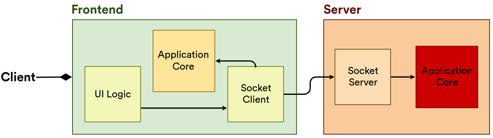

<h1 align="center">Chat APP</h1>

<p align="center">
  <a href="#star2-project">Project</a>&nbsp;&nbsp;&nbsp;|&nbsp;&nbsp;&nbsp;
  <a href="#rocket-technologies">Technologies</a>&nbsp;&nbsp;&nbsp;|&nbsp;&nbsp;&nbsp;
  <a href="#electric_plug-application-diagram">Application Diagram</a>&nbsp;&nbsp;&nbsp;|&nbsp;&nbsp;&nbsp;
  <a href="#scroll-requirements">Requirements</a>
</p>

<p align="center">
  
  
</p>

<p align="center">
  
</p>

## :star2: Project

A real-time chat for anyone to learn basic concepts of **WebSocket** and **native web development and architecture**.

## :rocket: Technologies

This project was developed with:

- HTML
- CSS
- Javascript
- NodeJS
- Socket.IO

## :electric_plug: Application Diagram

**Application Core**: retains and changes the state (users and messages) of the application. Implements the Pub/Sub pattern to inform its subscribers of changes in state.
<br/>
**UI Logic**: manages and listens to the frontend interface.
<br/>
**Socket Client/Server**: transport layer (reception and transmission) of data based on WebSocket.



## :electric_plug: Getting Started

Here you will run the application in development mode. Follow the steps below.

**Requirements**

[Node.js](https://nodejs.org)
<br>
[Yarn](https://yarnpkg.com) or [NPM](https://github.com/npm/npm)

**Cloning the repository**
```
$ git clone https://github.com/gabrielribeirof/chatter
```
**Installing the dependencies**
```
$ yarn install

# or
$ npm install
```

**Running Application**

```
$ yarn dev

# or
$ npm run dev
```

The application will provide the final URL.


# :scroll: Requirements

FR = Functional Requirement
<br/>
NFR = Non-Functional Requirement
<br/>
BR = Business Requirements
<br/>

## General

**NFR**

- Chat communication should be done through th socket.io library that provides a bidirectional WebSocket communication

## Register

**FR**

- User should be able to enter in the app with a nickname

**BR**

- The nickname and socket session ID should be stored attached to the socket server

## Messages

**FR**

- User should be able to send a new message to all users
- User should be able to receive new messages from any other user

## Chat Log

**FR**

- All users should notified when a user enter the chat
- All users should notified when a user leaves the chat
