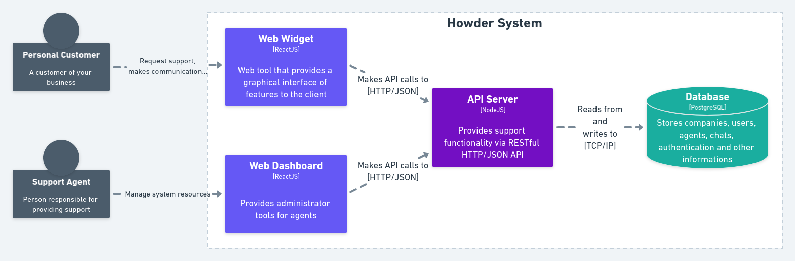

  

<h3 align="center">
  Business real-time support messenger
</h3>

  
  

## :star2: Introduction

Howder is a fictional platform that connects customers with a company's support team through real-time conversations with web browser-based core solution.

**Features**:
- **Live chat**: support customer with real-time conversations
- **Management tools**: manage customers and support teams data
- **Chat widget**: link a live chat direct in a company's site
- **Dashboard**: administration platform for support agents

## Table of Contents

- [Introduction]()
- [System Overview]()
- [API Server]()
  - [Technologies]()
  - [API Reference]()
  - [Design structure]()
  - [Developing]()
    - [First install]()
    - [Running tests]()

- [Web Widget]()
  - [Technologies]()
  - [Structure]()
  - [First install]()

- [Web Dashboard]()
  - [Technologies]()
  - [Structure]()
  - [First install]()

## System Overview

  

<i>System overview flow diagram</i>

## :electric_plug: API Server

Application that provides front-end applications with all the functionality of the system.

### :rocket: Technologies

Brief overview of the technology stack:

- **NodeJS**: javascript runtime platform
- **Typescript**: javascript superset language
- **Postgres**: persistent data storage
- **Docker** and **Docker Compose**: create the development environment
- **Express**: lightweight web server 
- **Jest**: test runner
- **TypeORM**: as ORM
- **Socket.io**: to bidirectional communication (mostly websocket)
- **i18next**: i18n implementation for server responses
- And other smaller software solutions... See overview in the API [package.json]() 

### API Reference

See the API Referente here: https://howder.readme.io/.

### Design structure

It is based on Clean Architecture, SOLID principles, and Domain-Driven Design best practices.

### Developing

#### :hammer_and_wrench: First Install

#### :test_tube: Running tests

## :computer: Web Widget

### :rocket: Technologies

### :scroll: Structure

### :hammer_and_wrench: First Install

## :computer: Web Dashboard

### :rocket: Technologies

### :scroll: Structure

### :hammer_and_wrench: First Install