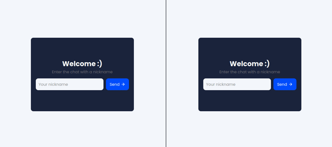

<h1 align="center">Chat APP</h1>

  <a href="#star2-project">Project</a>&nbsp;&nbsp;&nbsp;|&nbsp;&nbsp;&nbsp;
  <a href="#rocket-technologies">Technologies</a>&nbsp;&nbsp;&nbsp;|&nbsp;&nbsp;&nbsp;
  <a href="#scroll-requirements">Requirements</a>&nbsp;&nbsp;&nbsp;|&nbsp;&nbsp;&nbsp;

  

  

## :star2: Project

A real-time chat for anyone to learn basic concepts of **WebSocket** and **native web development and architecture**.

## :rocket: Technologies

This project was developed with:

- HTML
- CSS
- Javascript
- NodeJS
- Socket.IO

# :scroll: Requirements

FR = Functional Requirement
 
NFR = Non-Functional Requirement
 
BR = Business Requirements
 

## General

**NFR**

- Chat communication should be done through th socket.io library that provides a bidirectional WebSocket communication

## Register

**FR**

- User should be able to enter in the app with a nickname

**BR**

- The nickname and socket session ID should be stored attached to the socket server

## Messages

**FR**

- User should be able to send a new message to all users
- User should be able to receive new messages from any other user

## Chat Log

**FR**

- All users should notified when a user enter the chat
- All users should notified when a user leaves the chat
