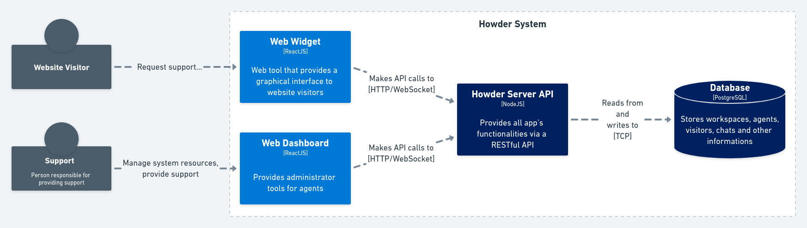
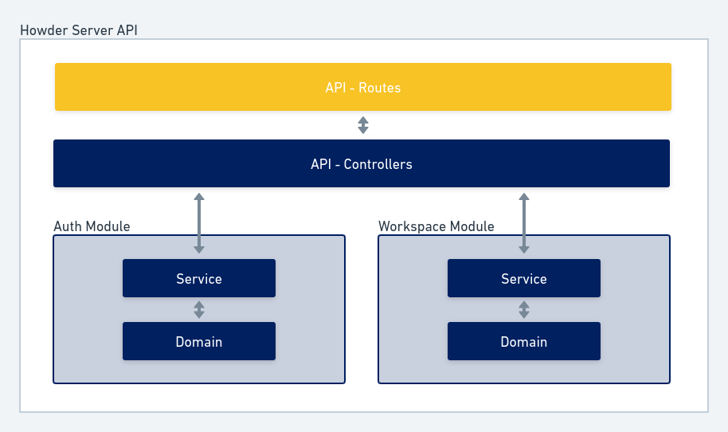

<p align="center"></p>
<p align="center">
  
</p>

<h3 align="center">
  Business real-time support messenger
</h3>

🚧 Under development

<p align="center">
  
  
</p>

## :star2: Introduction

Howder is a fictional platform that connects customers with a company's support team through real-time conversations.

## :scroll: Table of Contents

- [Introduction]()
- [System Overview]()
- [API Server]()
  - [Technologies]()
  - [API Reference]()
  - [Design decisions]()
  - [Developing]()
    - [First install]()
    - [Running tests]()
- [Web Widget]()
  - [Technologies]()
  - [First install]()
- [Web Dashboard]()
  - [Technologies]()
  - [First install]()

## System Overview

<p align="center">
  
</p>

## :electric_plug: API Server

Application that provides front-end applications with all the functionality of the system.

It is based on two communication layers, an **HTTP/REST API** for general operations and a **Websocket API** based on Socket.IO for sending real-time events.
Clients will receive events and data over the Websocket API they are connected to and send data over the HTTP API.

### :rocket: Technologies

Brief overview of the technology stack:

- **NodeJS**: javascript runtime platform
- **Typescript**: javascript superset language
- **Postgres**: persistent data storage
- **Docker** and **Docker Compose**: create the development environment
- **Express**: lightweight web server 
- **Jest**: test runner
- **TypeORM**: as ORM
- **Socket.io**: for bidirectional communication (mostly websocket)
- **i18next**: i18n implementation for server responses
- And other smaller software solutions... See overview in the API [package.json]() 

### API Reference

See the API Reference here: **https://howder.readme.io**.

### Architectural Design decisions

Howder API Server is a **modular monolith** with two modules based on Clean Architecture and SOLID principles. 



### Developing

In order to develop for this project, you must have Docker and Docker Compose.

#### :hammer_and_wrench: First install

1. **Clone the repository:**
```
$ git clone git@github.com:gabrielribeirof/howder.git
```

2. **Start database:**
```
$ docker-compose up database
```

3. **Then finally run the server:**
```
$ docker-compose up api_server
```

#### :test_tube: Running tests

## :computer: Web Widget

### :rocket: Technologies

Brief overview of the technology stack:

- **React**: web ui library
- **Typescript**: javascript superset language
- **Styled Components**: react styled component library
- **Socket.io**: for bidirectional communication (mostly websocket)
- And other smaller software solutions... See overview in the API [package.json]() 

### :hammer_and_wrench: First install

## :computer: Web Dashboard

### :rocket: Technologies

Brief overview of the technology stack:

- **React**: web ui library
- **Typescript**: javascript superset language
- **Styled Components**: react styled component library
- **Socket.io**: for bidirectional communication (mostly websocket)
- And other smaller software solutions... See overview in the API [package.json]() 

### :hammer_and_wrench: First install
